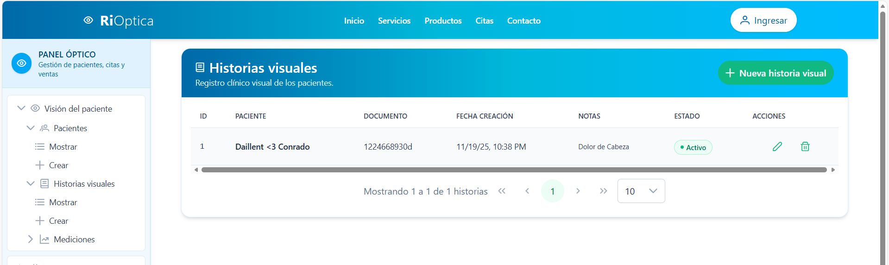

# 👩‍🦰 MANUAL DE USUARIO 👓

## Sistema de Optometría
Este manual fue creado con la intención de orientar a cualquier persona que vaya a utilizar el sistema de optometría. Aunque es un sistema sencillo de manejar, quise dejar por escrito cada parte para que todo quede claro, sobre todo cuando se usan los distintos módulos del CRUD.

------------------------------------------------------------------------

# 1. Información General

**Nombre del Sistema:** Sistema Optometría\
**Versión:** 1.0\
**Usuario objetivo:** Personal administrativo, optometristas y personal de apoyo\
**Frontend:** Angular\
**Backend:** Django\
**Base de datos:** MySQL\

Este manual explica paso a paso cómo utilizar el sistema, navegar por sus módulos principales y realizar operaciones CRUD sobre pacientes, citas, órdenes, pagos, entregas, optometristas, proveedores y datos clínicos visuales.
Este sistema de optometría nos va a permitir llevar un control organizado de pacientes, citas, mediciones visuales, órdenes, pagos, entregas y el inventario de lentes y monturas.  
Mientras fui probando todo, me di cuenta de que la idea general es que cualquier clínica u óptica pueda manejar su información sin complicarse.

------------------------------------------------------------------------

# 2. Requisitos del Sistema

## 2.1 Requisitos de Hardware

-   Computador o laptop
-   Resolución mínima: 1366×768
-   4 GB RAM (recomendado 8 GB)

## 2.2 Requisitos de Software

-   Navegador actualizado (Chrome, Edge, Firefox)
-   Conexión a internet
-   Acceso al servidor donde corre el sistema

------------------------------------------------------------------------

# 3. Acceso al Sistema

El sistema se ingresa desde el navegador ingresando la siguiente URL:

<http://localhost:4200/>

------------------------------------------------------------------------

# 4. Navegación General del Sistema

El sistema cuenta con un menú lateral/ superior donde se encuentran los módulos principales:

-   Pacientes

-   Historia Visual

-   Mediciones

    

-   Citas

-   Optometristas

    

-   Lentes

-   Monturas

-   Ordenes

-   Detalle de Orden

    

-   Proveedores

-   Pagos

-   Entregas

    

------------------------------------------------------------------------

# 5. Módulo de Pacientes (Patients) \

Aqui se muestra el modulo de pacientes, que normalmente es lo primero que uno consulta. Este módulo permite registrar y gestionar la información de los pacientes del centro de optometría. \

## 5.1 Vista de Lista – Consultar Pacientes

Aquí se muestra una tabla con todos los pacientes registrados.

y cuenta con las siguientes funciones: 
- Ver listado de pacientes
- Buscar un paciente
- Filtrar pacientes
- Crear nuevo paciente
- Editar informacion de un paciente
- Eliminar un paciente

## 5.2 ¿como Crear un Paciente?

1.  Hacer clic en **“Agregar Paciente”** o **“Nuevo”**.
2.  Completar los campos requeridos:
    -   Nombre
    -   Apellido
    -   Número de documento
    -   Teléfono
    -   Email
    -   Fecha de nacimiento
    -   Dirección
3.  Hacer clic en **Guardar**.

## 5.3 ¿como editar Paciente?

1.  Seleccione un paciente de la lista.
2.  Haga clic en **Editar**.
3.  Modifique los datos necesarios.
4.  Haga clic en **Actualizar**.

## 5.4 Eliminar Paciente

1.  En la lista, seleccione **Eliminar**.
2.  El sistema muestra un mensaje de confirmación.
3.  Acepte la eliminación.

Se muestra un cuadro de confirmación para evitar borrar registros por error.

------------------------------------------------------------------------

# 6. Módulo de Citas (Appointments)

Aquí se registran todas las consultas que tendrá el paciente. Es bastante útil porque queda todo fechado.

Funciones que tiene el modulo de citas: 
- Registrar o crear cita ---> allí pide los campos de fecha y hora, motivo, paciente, y que optomestrista desea que lo atienda
- Asignar optometrista
- Editar cita
- Cancelar o completar cita

------------------------------------------------------------------------

# 7. Módulo de Órdenes (Orders)

Permite registrar órdenes de lentes o monturas de un paciente.

Incluye:
- Crear una orden
- agregar lentes/monturas
- ver total
- estado de la orden

------------------------------------------------------------------------

# 8. Módulo de Pagos (Payments)

Aquí se registran los pagos asociados a una orden.

------------------------------------------------------------------------

# 9. Módulo de Entregas (Deliveries)

Permite registrar la entrega de una orden al paciente.

------------------------------------------------------------------------

# 10. Historia Visual y Mediciones

Incluye historial clínico del paciente y parámetros ópticos.

------------------------------------------------------------------------

# 11. Módulo de Optometristas

Permite registrar los profesionales que realizan las consultas.

------------------------------------------------------------------------

# 12. Módulo de Proveedores

Se gestionan los proveedores de lentes/monturas.

------------------------------------------------------------------------

# 13. Preguntas Frecuentes (FAQ)

**1. ¿Qué pasa si el sistema no carga?**
→ Verifique su conexión a internet o consulte al administrador.

**2. ¿Por qué no me deja guardar un paciente?**
→ Revise que todos los campos requeridos estén completos y cumplan las validaciones.

------------------------------------------------------------------------

# 14. Contacto de Soporte

**Correo:** [soporte\@optometria.com](mailto:soporte@optometria.com)\
**Horario:** L-V 8:00 a.m. – 6:00 p.m.

------------------------------------------------------------------------

